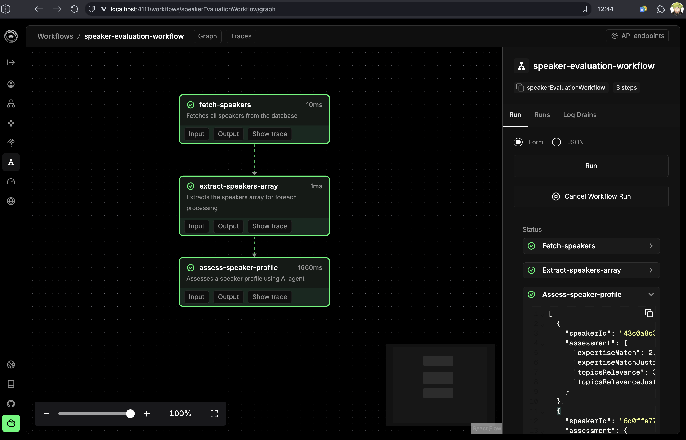
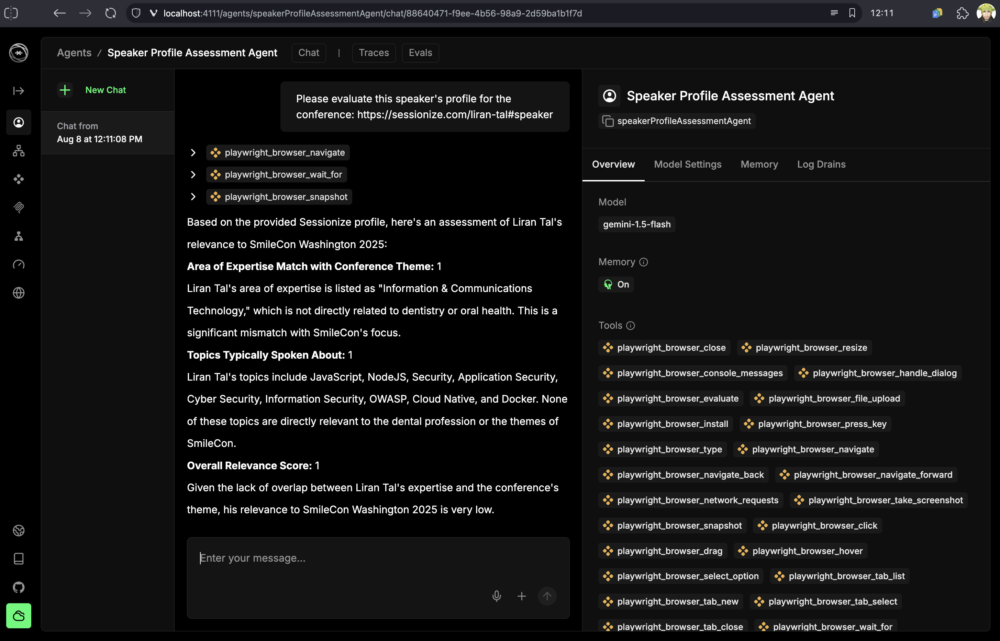

<p align="center"><h1 align="center">
  Mastra AI powered Event CFP Evaluation Agent
</h1>

<p align="center">
  A set of Mastra AI agent workflows to evaluate conference proposals (CFPs) and speakers
</p>

<p align="center">
  <a href="https://mastra.ai"></a>
</p>

<p align="center">
  
</p>

## ✨ What This Mastra AI Template Does For You

Tired of manually reviewing hundreds of conference session submissions? This project automates the entire Call for Papers (CFP) evaluation process using AI agents that intelligently score and rank proposals based on multiple criteria.

- **Automated Evaluation**: AI agents analyze session proposals and score them on relevance, technical depth, and overall quality
- **Smart Scoring**: Each submission gets scored on 6 different criteria with detailed justifications
- **Batch Processing**: Handle hundreds of submissions efficiently with queue-based processing
- **Resume Capability**: Never lose progress - the system can resume interrupted processing
- **Export Flexibility**: Export results to JSON or CSV for further analysis
- **Developer-Friendly**: Built with TypeScript, SQLite, and modern Node.js patterns

## 🧑‍🔧 Technology

This project uses the following technologies:

 - [MastraAI](https://mastra.ai) - The TypeScript Agent framework that powers this project
 - [Playwright MCP](https://github.com/microsoft/playwright-mcp) - The Playwright MCP server
 - [fastq](https://www.npmjs.com/package/fastq) - Matteo Collina's queue system
 - LLM - Relying on an LLM with system prompts for criteria evaluation process

## 🚀 Quick Start

Want to see it in action? Here's how to get started in under 2 minutes:

```bash
# Clone and install
git clone <your-repo>
cd devrel-cfp-committee
npm install

# Copy the Sessionize Sessions and Speakers JSONs to __fixtures__/db.json and __fixtures__/speakers.json 
# then: set up the database with sample data
npm run db:seed

# Workflow 1. Process all submissions with AI evaluation
npm run process-cfp

# Workflow 2. Evaluate speakers profile with AI evaluation via the Playground
npm run dev

# View the results
npm run db:view
npm run db:view:speakers
```

That's it! You'll have a fully processed dataset with AI-generated scores and justifications for each session submission.

## 🎯 Perfect For

- **Conference Organizers**: Automate the tedious CFP review process
- **DevRel Teams**: Scale your event planning without hiring more reviewers
- **AI/ML Developers**: Learn how to build production-ready AI workflows with Mastra
- **Open Source Maintainers**: See how to integrate AI agents into real-world applications

## Example Workflow: Event Speaker Profile Evaluation 

Provide the Speaker Profile Evaluation Agent with the user's Sessionize URL of the speaker's public profile and it will evaluate it based on relevance to the conference:

<p align="center">
  
</p>


## 🎯 Purpose

This project serves as a single-purpose entry point for processing CFP sessions. It:

- Loads session data from a JSON file into SQLite database
- Processes each session through an AI evaluation workflow
- Provides structured scoring and justification for each session
- Saves the complete evaluation results to a persistent database
- Supports resume capability for interrupted processing
- Tracks processing status for each session

## 🏗️ Architecture

### Core Components

1. **Main Entry Point** (`src/app.ts`)
   - Uses `fastq` to manage a queue of sessions
   - Processes sessions concurrently (1 at a time for testing)
   - Loads session data from SQLite database
   - Saves results to SQLite database with status tracking

2. **Database Service** (`src/services/database/index.ts`)
   - Manages SQLite database operations
   - Handles session persistence and status tracking
   - Provides resume capability for interrupted processing
   - Stores evaluation results with individual score fields

3. **CFP Evaluation Agent** (`src/mastra/agents/cfp-evaluation-agent.ts`)
   - Evaluates session proposals based on multiple criteria
   - Returns structured scores (1-5) with justifications
   - Currently uses mock data (can be replaced with real AI model)

4. **CFP Evaluation Workflow** (`src/mastra/workflows/cfp-evaluation-workflow.ts`)
   - Orchestrates the evaluation process
   - Processes session data through the evaluation agent
   - Returns structured evaluation results

### Data Flow

```
Session Data (JSON) → Database (SQLite) → Queue (fastq) → Workflow → Agent → Database (SQLite)
```

## 📊 Evaluation Criteria

Each session is evaluated on the following criteria (1-5 scale):

- **Title**: Clarity, engagement, and descriptiveness
- **Description**: How well it explains content, value, and target audience
- **Key Takeaways**: Value and actionability of provided takeaways
- **Overall Quality**: Overall assessment of proposal quality and completeness
- **Relevance**: Relevance to conference theme and target audience
- **Technical Depth**: Technical sophistication and depth of content

## 🚀 Getting Started

### Prerequisites

- Node.js >= 20.9.0
- npm or pnpm

### Installation

```bash
npm install
```

### Database Setup

First, seed the database with session data:

```bash
npm run db:seed
```

This will:
1. Create the SQLite database (`sessions.db`)
2. Create the sessions table
3. Load session data from `__fixtures__/db.json`
4. Display database statistics

### Running the Application

```bash
npm run process-cfp
```

This will:
1. Connect to the SQLite database
2. Find all unprocessed sessions (status = 'new')
3. Process sessions through the evaluation workflow
4. Update session status to 'ready' when complete
5. Store evaluation results in the database
6. Display a summary of processing results

### Viewing Database Contents

To view the current state of the database:

```bash
npm run db:view
```

This shows:
- Database statistics (total, processed, unprocessed sessions)
- Details of processed sessions with scores
- List of unprocessed sessions

### Exporting Database to JSON

To export all session data to JSON format:

```bash
npm run db:export
```

This creates `sessions-export.json` with:
- Array of session objects
- Each object contains:
  - `sessionData`: Original session data
  - `evaluation`: AI evaluation results (null if not processed)
  - `evaluationScoreTotal`: Total evaluation score (null if not processed)
- Sessions without evaluations have `evaluation: null` and `evaluationScoreTotal: null`
- Useful for backup, analysis, or integration with other systems

### Exporting Database to CSV

To export all session data to CSV format:

```bash
npm run db:export-csv
```

This creates `sessions-export.csv` with:
- CSV header with all field names
- One row per session
- All session data fields (id, title, description, speakers, categories, questionAnswers)
- All evaluation fields (scores and justifications for each criterion)
- Total evaluation score
- Timestamps (created_at, completed_at)
- Proper CSV formatting with quoted fields for multiline text
- Useful for spreadsheet analysis, reporting, and data visualization

### Filtering and Exporting Sessions by Status

To filter sessions by status and export to a new JSON file:

```bash
npm run db:export-filtered [status]
```

**Arguments:**
- `status` (optional): The status to filter by (e.g., "Nominated", "Accept_Queue", "Decline_Queue"). Defaults to "Nominated" if not provided.

**Examples:**
```bash
npm run db:export-filtered Nominated
npm run db:export-filtered Accept_Queue
npm run db:export-filtered Decline_Queue
```

This creates a filtered JSON file (e.g., `db-nominated.json`, `db-accept-queue.json`) with:
- Only sessions matching the specified status
- Maintains the same structure as the original `db.json`
- Useful for creating status-specific datasets for further processing
- Shows available statuses in the database for reference

### Resetting Processed Sessions

To reset all processed sessions back to their initial "new" state:

```bash
npm run db:reset
```

This utility:
- Finds all sessions with status "ready" (processed)
- Resets their status to "new"
- Clears all evaluation data (scores, justifications, timestamps)
- Shows before/after statistics
- Useful for testing, reprocessing, or starting fresh evaluations

**Use Cases:**
- Testing the evaluation workflow with fresh data
- Reprocessing sessions with updated evaluation criteria
- Starting over after making changes to the evaluation logic
- Clearing processed data for demonstration purposes

### Development

Start the Mastra development server:

```bash
npm run dev
```

This starts the Mastra playground at `http://localhost:4111` where you can test workflows interactively.

## 📁 Project Structure

```
devrel-cfp-committee/
├── __fixtures__/
│   └── db.json                 # Sample session data
├── src/
│   ├── app.ts                  # Main entry point
│   ├── mastra/
│   │   ├── agents/
│   │   │   └── cfp-evaluation-agent.ts
│   │   ├── workflows/
│   │   │   └── cfp-evaluation-workflow.ts
│   │   └── index.ts           # Mastra configuration
│   ├── services/
│   │   ├── database/
│   │   │   ├── index.ts       # Database service
│   │   │   └── README.md      # Database documentation
│   │   └── sessionize/        # Sessionize API integration
│   └── scripts/
│       ├── seed-database.ts   # Database seeding script
│       ├── view-database.ts   # Database viewing script
│       ├── export-database.ts # Database export script
│       ├── export-database-csv.ts # Database CSV export script
│       ├── export-database-filtered.ts # Filtered export script
│       └── reset-processed-sessions.ts # Reset processed sessions script
├── sessions.db                 # SQLite database file
├── sessions-export.json        # Exported session data (generated)
├── sessions-export.csv         # Exported session data in CSV format (generated)
├── package.json
└── README.md
```

## 🔧 Configuration

### API Keys

To use real AI evaluation (instead of mock data), set up API keys:

```bash
export GOOGLE_GENERATIVE_AI_API_KEY=your_api_key_here
```

Then uncomment the agent.generate() code in the workflow and comment out the mock evaluation.

### Queue Configuration

The application processes 2 sessions concurrently by default. You can modify this in `src/app.ts`:

```typescript
const queue = fastq.promise(processSession, 2); // Change 2 to desired concurrency
```

## 📈 Output

The application generates:

1. **Console Output**: Real-time processing status and summary
2. **SQLite Database**: Complete evaluation results stored in `sessions.db` including:
   - Original session data (JSON)
   - AI evaluation scores and justifications (individual fields)
   - Processing status and timestamps
   - Individual score fields for easy querying

### Database Schema

The `sessions` table contains:
- `id`: Session identifier (primary key)
- `title`: Session title
- `session_data`: JSON stringified session data
- `status`: Processing status ('new' or 'ready')
- `evaluation_results`: JSON stringified evaluation results
- Individual score fields: `title_score`, `description_score`, `key_takeaways_score`, `given_before_score`
- Individual justification fields: `title_justification`, `description_justification`, etc.
- `evaluation_score_total`: Sum of all individual scores (4-20 range)
- `created_at`: When session was added to database
- `completed_at`: When processing was completed

### Sample Database Output

```sql
SELECT id, title, title_score, description_score, evaluation_score_total, status, completed_at 
FROM sessions WHERE status = 'ready';
```

Returns processed sessions with individual scores and total score for easy analysis and reporting.

## 🔄 Workflow Integration

The system integrates with Mastra's workflow system:

- **Workflows**: Define the evaluation process
- **Agents**: Handle AI-powered evaluation
- **Steps**: Individual processing units
- **Storage**: Persists workflow state and results

## 🛠️ Customization

### Adding New Evaluation Criteria

1. Update the agent's output schema in `cfp-evaluation-agent.ts`
2. Modify the workflow's evaluation logic in `cfp-evaluation-workflow.ts`
3. Update the mock evaluation data structure

### Changing Data Sources

Modify the `loadSessions()` function in `src/app.ts` to load from different sources (API, database, etc.).

### Adjusting Processing Logic

The `processSession()` function in `src/app.ts` handles individual session processing. Modify this to add custom logic, error handling, or different output formats.

## 📝 Scripts

- `npm run process-cfp`: Process all unprocessed sessions
- `npm run db:seed`: Initialize and seed the database
- `npm run db:view`: View database contents and statistics
- `npm run db:export`: Export all sessions to JSON format
- `npm run db:export-csv`: Export all sessions to CSV format
- `npm run db:export-filtered [status]`: Filter and export sessions by status
- `npm run db:reset`: Reset all processed sessions to "new" state
- `npm run dev`: Start Mastra development server
- `npm run build`: Build Mastra workflows
- `npm run start`: Start Mastra server
- `npm run db`: Start JSON server for development

## 🤝 Contributing

1. Fork the repository
2. Create a feature branch
3. Make your changes
4. Test with `npm run process-cfp`
5. Submit a pull request

## 📄 License

Apache-2.0 License

## ✍️ Author

Liran Tal - [@liran_tal on X](https://x.com/liran_tal) |  [@lirantal on GitHub](https://github.com/lirantal) | [website](https://lirantal.com)